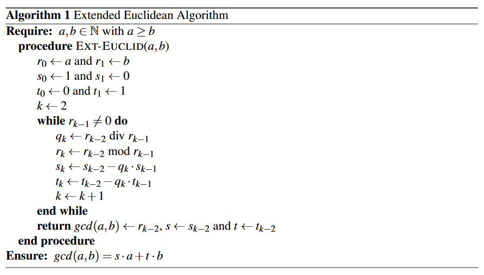
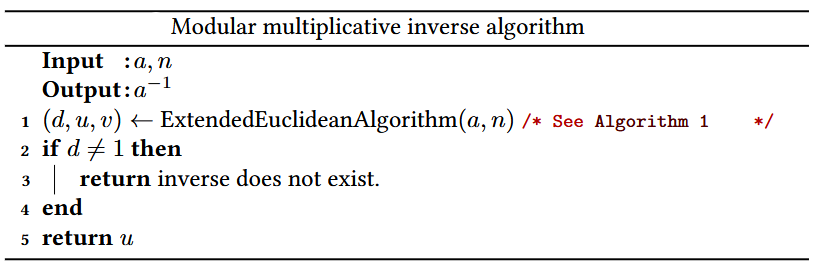
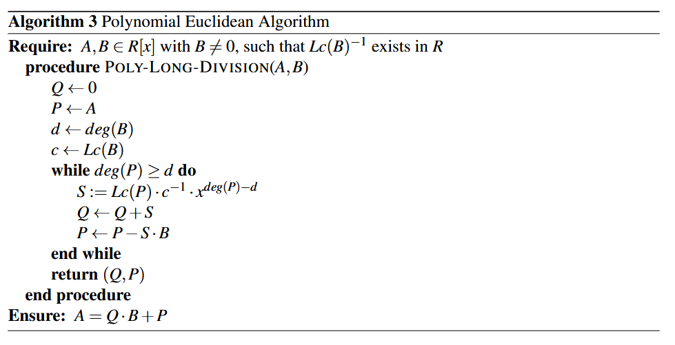
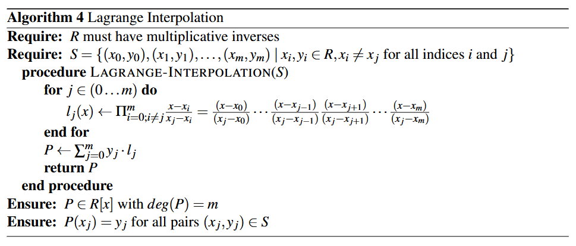
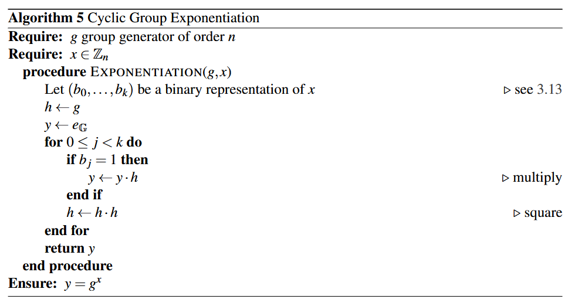
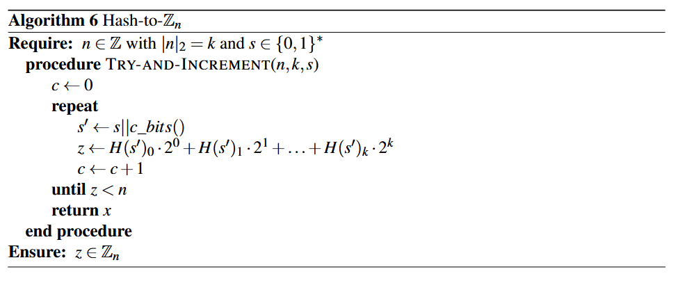
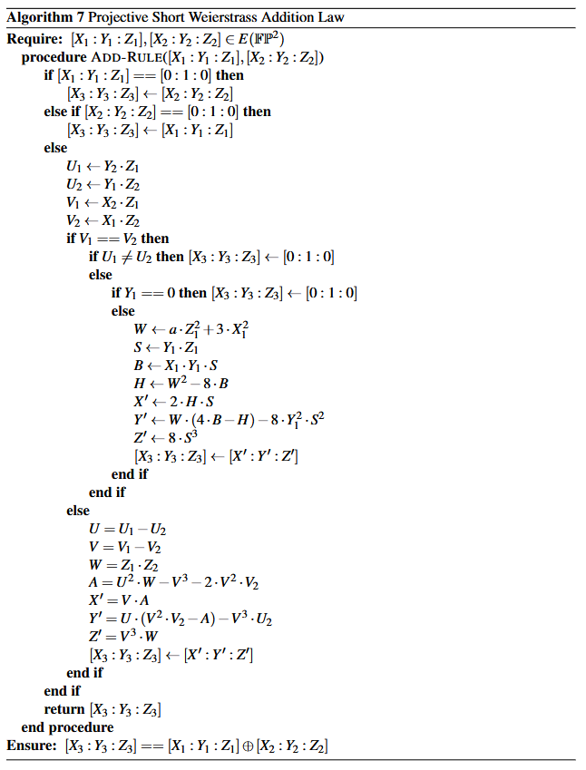
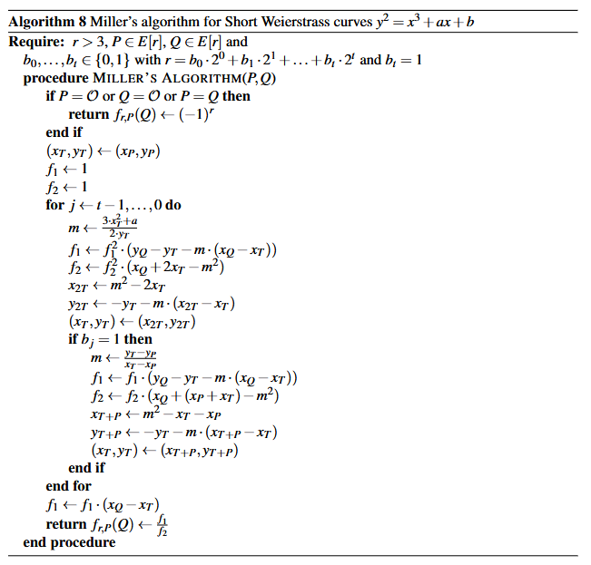
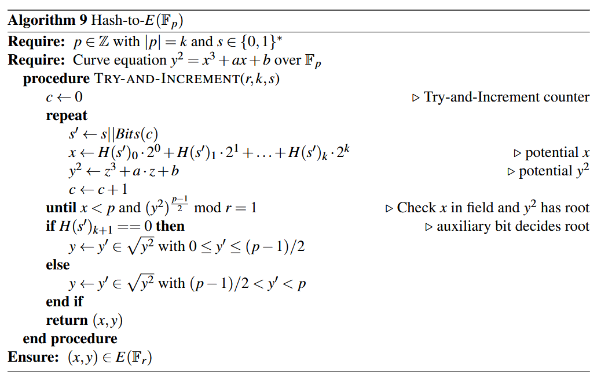
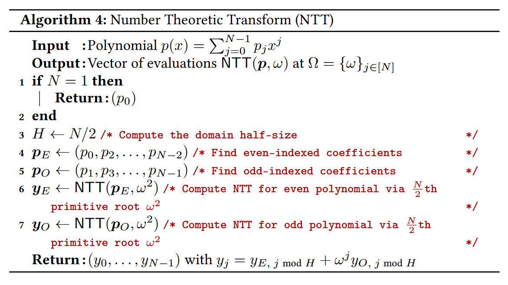

#### Extended Euclidean Algorithm

#### Modular multiplicative inverse algorithm

#### Chinese Remainder Theorem

#### Polynomial Euclidean Algorithm

#### Lagrange Interpolation

#### Cyclic Group Exponentiation

#### Hash-to-Zn

#### Projective Short Weierstrass Addition Law

#### Miller’s algorithm for Short Weierstrass curves

#### Hash-to-E(Fp)

#### Number Theoretic Transform (NTT)
